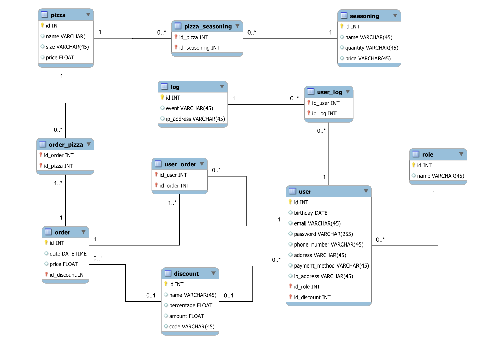

# PizzeriaExampleBackend
## _An example of a pizzeria website_

 

## Introduction

We want a portal of entrance, and we put our credentials, whether we are the owner, a waiter, or a customer, and from there process a different user interface and experience based on WHO (Authorization/Authentication) we are. An owner will see a Backoffice, a customer will see that he can select pizzas, season them and buy them, he will possess a cart to do so. A waiter will probably see different elements that are related to his position.

## Database schema

 

Here is below a proposition of the current database schema for this application (designed with MySQL Workbench):

